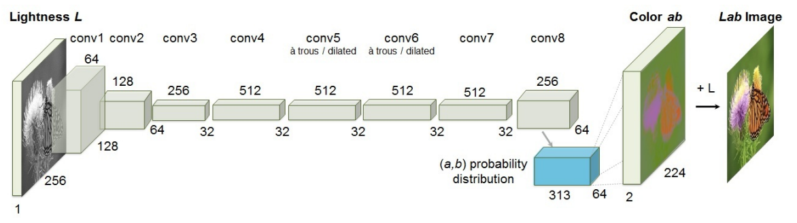
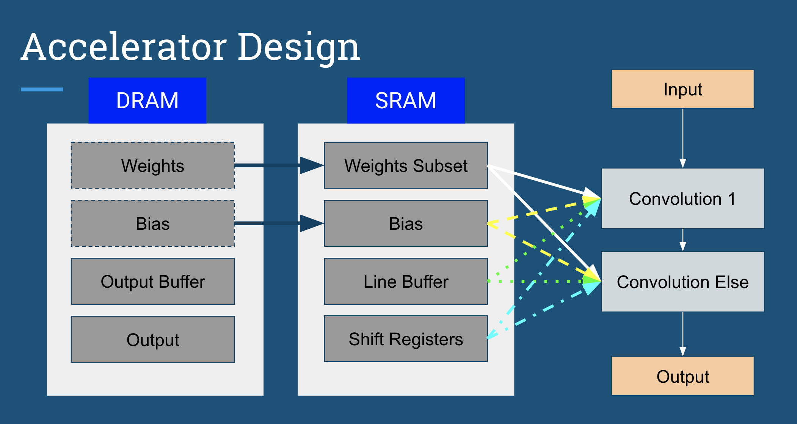

# EE109 Digital System Lab Final Report
Ron Domingo (rdomingo) and Michael Lu (mingci7)

## Table of Contents
- Application Overview
- Software Simulation
- Hardware Implementation
- Design Tradeoffs

## Application Overview
Machine Learning is an evolving field that has impacted many sectors of society, enabling new technologies and eliminating costly, manual efforts such as data analysis. One application that requires a costly and tedious process is the colorization of black-and-white photos, which used to require dozens of hours selecting proper color hues and attempting to make color contrasts realistic. With the rise of CNNs, however, computerized colorization trained on neural networks has been shown to achieve up to 32% success rates in fooling humans into believing the image is real. The downside to this automated approach is that CNNs take a lot of time and software resources to train and run. Therefore, it could take hours and even days to train a proposed model and determine the parameters for most accurate prediction. Hardware resources can speed up low-level operations such as convolution and multiply-and-add, which are the main bottleneck of CNN training and inference. We attempt to implement the colorization CNN in hardware, checking to see if deploying the CNN on hardware could result in multiple folds in speedup.

(Links to the CNN framework and model we based our implementation on--
Paper: https://arxiv.org/pdf/1603.08511.pdf
GitHub repo: https://github.com/richzhang/colorization)

The existing software implementation presented in the GitHub repo runs on an outdated version of Caffe, which is itself outdated and has since been replaced by more advanced and user-friendly deep learning frameworks such as PyTorch and TensorFlow. Additionally, the implementation relied on multiprocessing resources such as GPU acceleration to run training and inference. Even then, it took a long time to train, with some people reporting training times of over a day. We attempted to design a software implementation that would be more accessible for inference purposes, running only on the CPU without extensive use of GPU resources. 

## Software Simulation 
Our software implementation runs the entire CNN on Python, using NumPy as the backbone to creating arrays and running matrix operations. A large roadblock in the process was extracting the weights, bias, mean and variance values from the trained model in Caffe, which required some clever tricks to open up the files, examine the numbers, and then export them to csv files for more convenient matrix conversion. Another issue we encountered was typecasting and converting between 2-D and 4-D arrays, since the weight matrixes were in 4-D but the csv files could only save values in 2-D. Finally, we needed to truncate the 64-bit floating point values to floating point values with five digits after the decimal point to reduce runtime and make sure our implementation could run within a reasonable time period. To that effect, we also introduced a processor pool to run each of the filters for the different convolutional blocks to increase parallelization. 

Our final implementation basically replicated the entire framework of the CNN introduced in the paper and in the GitHub repo, including padding and dilation for the convolutions, normalization after each convolutional layer, and a final softmax layer. Future improvements are always still viable, including rewriting certain parts with GPU code and CUDA acceleration, rewriting the implementation in a lower-level language with SIMD capabilities such as C++ for increased speedup, and further parallelization optimizations.

## Hardware Implementation

  Our implementation features two convolution modules that utilize several DRAM elements, and reuse the same set of SRAM elements between the modules. The input, weights, and biases are all saved as csv files that are loaded into DRAM. The weights for the CNN are originally stored in a 4 dimensional matrix, but since csvs are limited to 2 dimensions, the weights were previously flattened to fit the csv format. To account for this, our accelerator has to use a custom indexing scheme to access the proper element in each weights file. In the diagram, the weights and bias DRAM elements have a striped border because they are each not actually one cohesive DRAM element. There are multiple DRAM elements for each of the weights and biases at every convolutional layer. Once the files loaded into DRAM, subsets of the data are loaded into SRAM during the convolution loops. A weights SRAM element was required to buffer the weights data on the FPGA chip because there is not enough SRAM space to store the entire weights data for the different convolution layers. The biases, however, can be loaded completely into SRAM. The line buffer and shift registers are used to buffer the module input in order to perform the convolutions. The output of the convolution is then stored on DRAM also because the outputs would exceed the SRAM space if stored on chip.  
  
  Due to the nature of the convolutions in the colorization CNN, our implementation required two different convolution modules. Convolution 1 in the diagram represents the first image processing convolution where the input has a fixed depth of 1. The Convolution Else features a completely modular convolution function where the depth, channel size, input size, and kernel size are all parameterized. Each of the convolution modules share the same SRAM resources to reduce the memory footprint of the functions. The output of each are also stored in a DRAM buffer so that it can then be read by the next convolution function in the network. 

## Design Tradeoffs
  Our main goal for our accelerator was to reuse as many of the hardware and memory elements as possible. Given the size of the CNN, we knew that an explicit implementation of the network would greatly exceed the resources of the FPGA. Thus we needed to modularize our hardware implementation in order to do the full pipeline. In addition, the weights and function inputs/outputs were too large in size to store in SRAM during the convolutions so we were required to constantly stream data back and forth between DRAM and SRAM so that we can stay within the limitations of the SRAM memory. In doing so we had to incorporate SRAM buffering for many of the DRAM elements. However, a CNN is runs in a linear fashion, so we could reuse the same SRAM elements for each convolution since only one convolution was running at a particular time. This allowed us to reduce our SRAM memory usage for our implementation. Currently, our implementation only performs the first convolutional block of the network which features two convolution layers. However, if were to continue with the project, we would reuse the Convolution Else module defined above and paralellize the convolution loops so that we can greatly maximize the hardware resources of the FPGA. 
